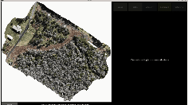

# Multiview Labeling
An interactive labeling tool for efficient, multiview annotation of forest datasets from drone imagery.

## Overview
This tool streamlines the labeling of forests in high-resolution drone orthomosaics by automatically extracting and displaying side (oblique) views for any selected region. By leveraging both top-down and side perspectives, it improves annotation accuracy and efficiency for machine learning applications in forest management.

## Features
- Interactive GUI: Orthomosaic viewer with zoom/pan, bounding box selection, and side-view display.
- Automatic Side-View Extraction: Maps selected regions to corresponding oblique views using geographic metadata.
- Segmentation Integration: Utilizes the Segment Anything Model for precise tree segmentation.

## Workflow
1. Preprocessing:

   Generate a 3D mesh and orthomosaic from raw drone images using photogrammetry software (e.g., Agisoft Metashape).

   Prepare the original images, cameras file (.xml), orthomosaic (.tiff), and 3D mesh (.ply) as input.

2. Labeling:

   Launch the tool with your inputs.

   Draw bounding boxes around trees; side views are automatically extracted and displayed to the right.

   Assign labels (e.g., species, health status) to each selection.

3. Export:

   Save annotations to a .gpkg file, which includes:
   - Label
   - Image and geographic coordinates
   - Segmentation contours and polygons

## Important files

- gui.py includes the main app. This is the file to run.

- render_sideviews.py is a helper file that renders sideviews (using geograypher, see https://github.com/open-forest-observatory/geograypher) from the ortho bounding box

- sam.py uses efficientvit (see https://github.com/mit-han-lab/efficientvit) to segment images

## Demo of the app working in real time

<!--  -->

For more details, contact xeniazhao76@gmail.com or haucke@mit.edu